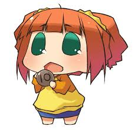

# Gacha



How to run

```shell
go get -u github.com/lib/pq
go build
./gacha
```

Dependencies:

You need PostgreSQL.
Make a user "golang" without password. If you want to use a password for the user, edit `db()` function of `data/data.go`.
Create tables with `data/setup.sql`.
